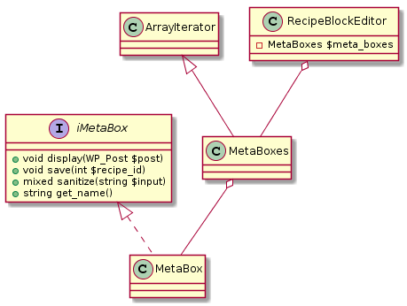

# Cooking By The Book
_Makes wordpress a community driven recipe sharing platform_

Tested with Wordpress 5.2 and PHP 7.3.3  
Uses modern JavaScript (>=ES6) tested in 
Firefox Quantum 66.0.5, 
Microsoft Edge 42.17134.1.0 (EdgeHTML 17.17134) 
and Google Chrome 74.0.3729.157 

## How-To
### Show recipes on the front page / home page
Make sure you're logged in and the Cooking By The Book plugin is installed and activated.
In the administrative screens navigate to: Settings -> Cooking By The Book

On the settings page, tick the box that enables the required feature. Then click save.

Please note that _ideally_ your theme should support and display recipe type posts.

### Allow visitors to self register
Make sure you're logged in and the Cooking By The Book plugin is installed and activated.
In the administrative screens navigate to: Settings -> General
In the Membership section tick the Box "Anyone can register".
Set the "New User Default Role" to "Recipe Author".

## Features
### Adds a new post type: Recipe
- Reduced Block editor
- Added Meta-Boxes
    - To manage: Ingredients, Durations, Difficulty, Servings
    - Interaction with Gutenberg Editor via WP(/Redux)-Store
    - Hand-made js library, utilizing only components already shipped with wordpress. Manages the creation of an 
      ingredients list as a meta datum of a recipe (see `assets/js/ingredients-meta-list.js`)
        - Drag and Drop support
        - Touch support (via jquery.ui.touch-punch plugin)
        - History (Undo/Redo functionality)
        - minified & transpiled with 
          `npx babel ingredients-meta-list.js --out-file ingredients-meta-list-compiled.js --source-maps` presets 
          defined in `.babelrc` and acquired via npm.  
          If you wish to compile yourself, have [npm](https://www.npmjs.com/) installed navigate to `assets/js` run 
          `npm i` and then the `npx` command as documented above.
    - Managed by `recipe-blocks.php`:  
      Further Meta-Boxes can be by integrating like the other ones as described in the following UML diagram:
      
    - Introduced new WP-API Endpoint for recipes.  
      Effort to improve the documentation along the way: https://github.com/WP-API/docs/pull/45
    - Front and Back-end CSS to display metadata (input)
- Added Taxonomies
    - World cuisine and meal type

### Adds a new role: Recipe Author
- Modified (reduced) back-end for logged in recipe authors
- Can only create recipes
  - Changed admin menu and admin bar
- Can only see own recipes
    - Fixed counting of recipe post type in backend (counting only own recipes instead of recipes by all users)
- Can manage recipe related comments
    - Can only see comments related to own recipes (in the backend)
    - Can only edit/remove own comments
    - Reduced moderation options in backend to "quick edit", "edit" and "trash"
    - Reduced comment tabs to "all", "mine" and "trash"
    - Reduced bulk actions
- Can only see own media
- Brings own capabilities that are checked throughout the plugin to ensure recipe authors can't do more than they 
  should.

### Logging
- Ships with it's own handcrafted logging module for debugging!

### Full i18n support
- Text domain: `cbtb-recipe`

### Hooks & Filters
Allowing the extension of this plugin with your own functionality.

#### Filters
- `cbtb-ingredients-pre-table-generation`: Allows to modify the array that is transformed into an front end HTML-Table 
  of ingredients.
- `cbtb-ingredients-post-table-generation`: Allows to modify the generated html string (which represents the frontend 
  facing ingredients list)
#### Hooks
- `cbtb_plugin_activated`: Fired when the plugin is activated.

### Settings
- Ships with own settings page located as child under the WordPress settings menu (`options-general.php`)

## Default Settings
- Log: on/**off**
- Only recipes on home on/**off**
- append recipes the_content with recipe meta data on/**off**

Icons made by [Freepik](https://www.freepik.com/) from 
[www.flaticon.com](https://www.flaticon.com/) is 
licensed by [CC 3.0 BY](http://creativecommons.org/licenses/by/3.0/)

## Misc
- `cd phpStormProjects\pro-at-cooking\wp-content\plugins\cooking-by-the-book\assets\js`
